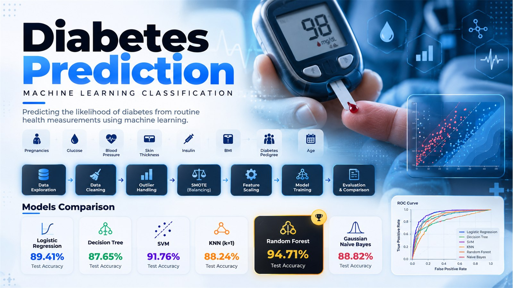

<p align="center">
  
</p>

# Diabetes Prediction

A machine-learning classification project that estimates whether a patient is likely to have diabetes from routine health measurements. The work is documented in the `Diabetes_Prediction.ipynb` notebook and uses the Pima Indians Diabetes dataset.

> **Medical disclaimer:** This project is for educational and research purposes only. It is not a medical device and must not be used as a substitute for professional medical diagnosis or advice.

## Project objectives

- Build a Logistic Regression baseline.
- Compare it with Decision Tree and Support Vector Machine (SVM) classifiers.
- Explore additional classifiers: K-Nearest Neighbors (KNN), Random Forest, and Gaussian Naive Bayes.
- Clean and scale the dataset before training.
- Evaluate the core models with a hold-out test set, classification reports, ROC curves, and 5-fold cross-validation.

## Dataset

The project uses `diabetes.csv`. Each record contains eight input features and a binary target named `Outcome`:

| Feature | Description |
| --- | --- |
| `Pregnancies` | Number of pregnancies |
| `Glucose` | Plasma glucose concentration |
| `BloodPressure` | Diastolic blood pressure (mm Hg) |
| `SkinThickness` | Triceps skin-fold thickness (mm) |
| `Insulin` | Two-hour serum insulin (mu U/ml) |
| `BMI` | Body mass index (kg/m²) |
| `DiabetesPedigreeFunction` | Diabetes pedigree score |
| `Age` | Age in years |
| `Outcome` | Target: `1` for diabetes and `0` for no diabetes |

## Workflow

1. **Data inspection** – reviews data types, missing values, duplicate rows, zero-value rates, distributions, and box plots.
2. **Data cleaning** – replaces invalid zero values in `Glucose`, `BloodPressure`, `SkinThickness`, `Insulin`, and `BMI` with class-specific medians.
3. **Outlier handling** – detects outliers with the IQR method and removes outliers from `SkinThickness`, `Insulin`, and `BMI`.
4. **Class balancing** – applies SMOTE to balance the two outcome classes.
5. **Feature scaling** – uses `MinMaxScaler` for `Pregnancies`, `Glucose`, `BloodPressure`, `SkinThickness`, `Insulin`, `BMI`, and `Age`.
6. **Training and comparison** – splits the data into 80% training and 20% test data, then trains the classifiers.
7. **Evaluation** – compares accuracy, classification reports, ROC/AUC curves, a confusion matrix, and 5-fold cross-validation scores.

## Models

| Model | Notes |
| --- | --- |
| Logistic Regression | Baseline classifier; maximum 500 iterations |
| Decision Tree | Uses `random_state=42` |
| SVM | Configured with probability estimates for ROC/AUC |
| KNN | Tunes `n_neighbors` from 1 to 24 with 5-fold grid search |
| Random Forest | Tunes estimator count, depth, and feature selection with 5-fold grid search |
| Gaussian Naive Bayes | Additional probabilistic baseline |

## Recorded results

The following results are saved in the notebook output. Values can differ if preprocessing, library versions, or random sampling change.

| Model | Test accuracy |
| --- | ---: |
| Logistic Regression | 89.41% |
| Decision Tree | 87.65% |
| SVM | 91.76% |
| KNN (`k=1`) | 88.24% |
| Random Forest | 94.71% |
| Gaussian Naive Bayes | 88.82% |

For the three required comparison models, 5-fold cross-validation selected the **Decision Tree** as the best model:

| Model | Mean 5-fold CV accuracy |
| --- | ---: |
| Logistic Regression | 85.94% |
| Decision Tree | 88.77% |
| SVM | 88.65% |

The selected Decision Tree achieved this hold-out confusion matrix:

```text
[[74,  9],
 [12, 75]]
```

## Project files

```text
Diabetes Prediction/
├── Diabetes_Prediction.ipynb       # End-to-end analysis, training, and evaluation
├── diabetes.csv                    # Input dataset
├── logistic_regression_model.pkl   # Saved Logistic Regression model
├── decision_tree_model.pkl         # Saved Decision Tree model
├── svm_model.pkl                   # Saved SVM model
└── scaler.pkl                      # Saved Min-Max scaler
```

## Installation

Use Python 3.9 or later. Create and activate a virtual environment, then install the dependencies:

```bash
python -m venv .venv
```

```bash
# Windows PowerShell
.\.venv\Scripts\Activate.ps1
pip install pandas numpy matplotlib seaborn scikit-learn imbalanced-learn joblib jupyter
```

## Run the project

1. Place all project files in the same directory.
2. Activate the environment and start Jupyter:

   ```bash
   jupyter notebook
   ```

3. Open `Diabetes_Prediction.ipynb` and run its cells from top to bottom.

The notebook reads `diabetes.csv` through a relative path, so it should be launched from the project directory.

## Saved models

The notebook serializes three trained classifiers and the scaler using Joblib. Load an artifact only from a trusted source:

```python
import joblib

model = joblib.load("decision_tree_model.pkl")
scaler = joblib.load("scaler.pkl")
```

When predicting new observations, use the exact feature names and ordering listed in the dataset section. Apply the same preprocessing and scaling used during training before calling `model.predict(...)`.

## Future improvements

- Put preprocessing and SMOTE inside a scikit-learn/imbalanced-learn pipeline to prevent data leakage during evaluation.
- Apply resampling only to the training folds, never before the train/test split.
- Save the full preprocessing pipeline together with the selected model.
- Validate on an independent dataset and report metrics beyond accuracy, such as recall, precision, F1 score, and ROC-AUC.
- Add a tested prediction interface with input validation.

## License

No license file is included in this project directory. Add an explicit license before redistributing the code or models.
